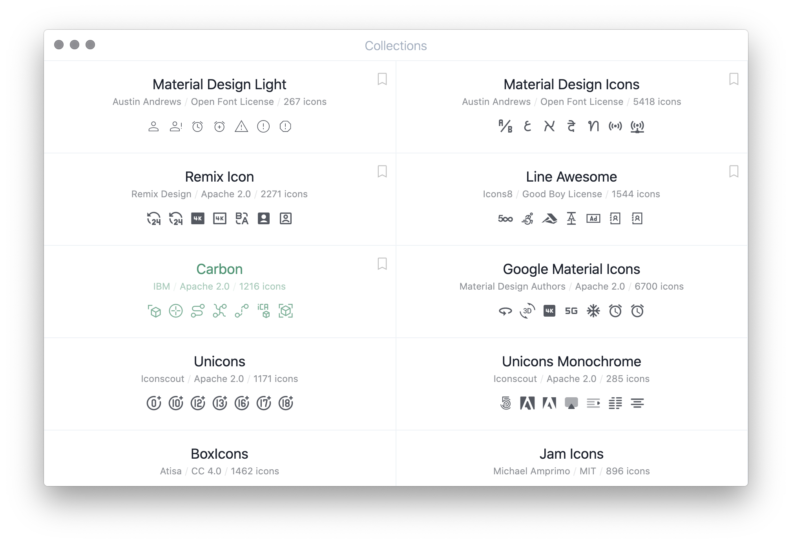
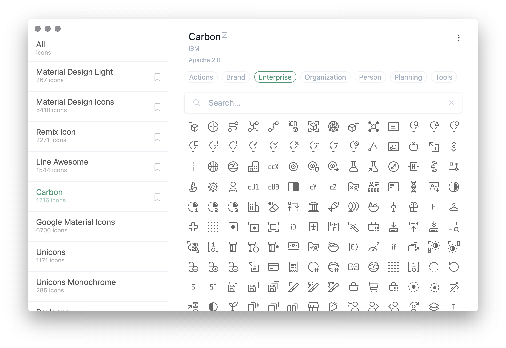
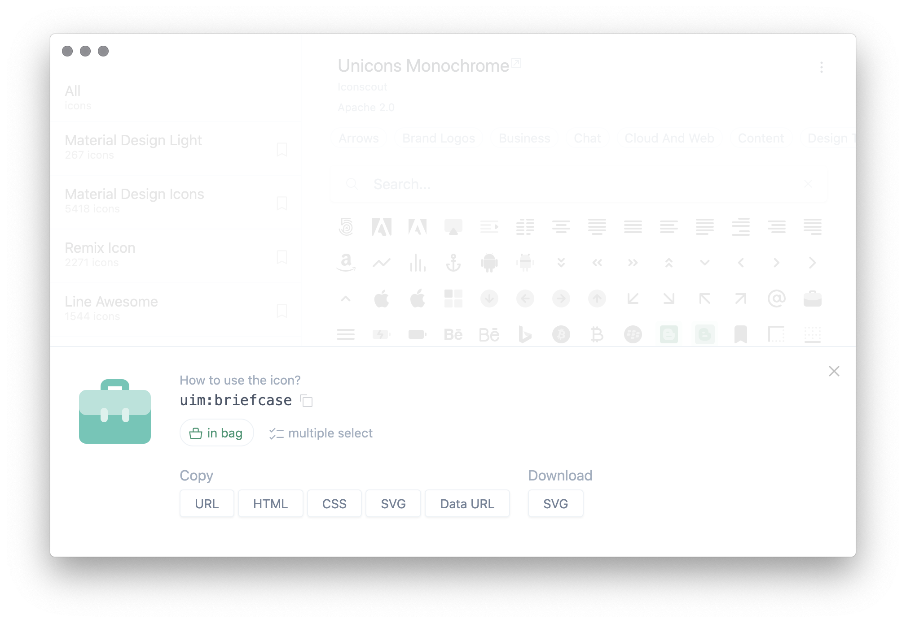
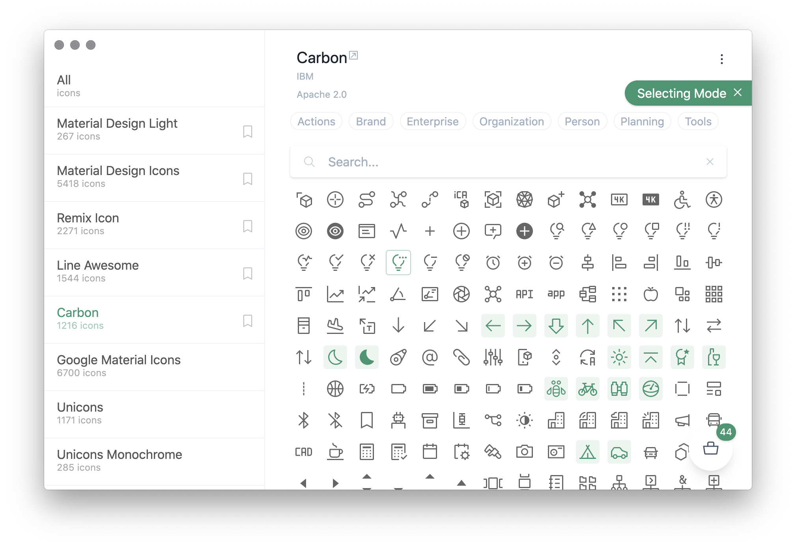
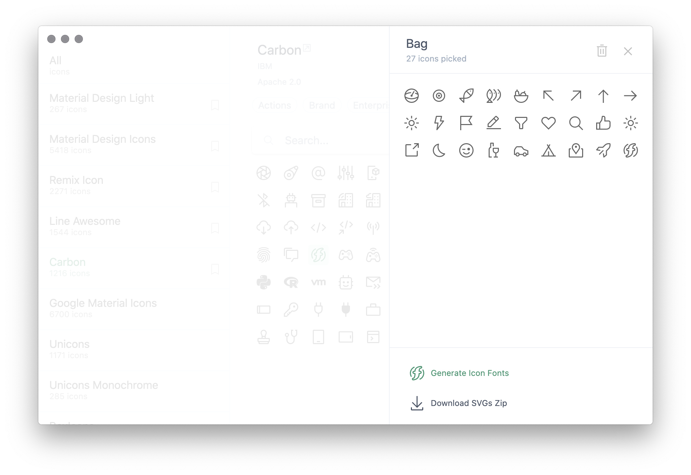
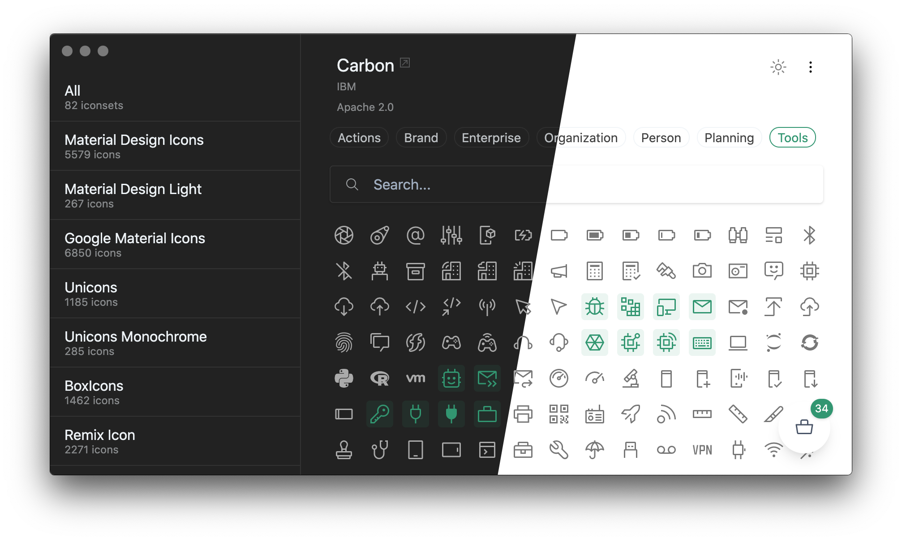

<h1 align="center">
Icônes
</h1>

Icon Explorer with <b>Instant</b> searching, powered by <a href="https://github.com/iconify/iconify" target="_blank">Iconify</a>

### Usage

1. Open command palette with `cmd+shift+p`
2. Enter command `Icones: Find icons`

### Screenshots

<em>Dark Mode is now Live!</em>

### Features

- **Instant Fuzzy Searching** _- all are done locally, no web queries!_
- The **Bag** _- select your icons and pack them into a ready-to-use icon font!_
- Copy the usage scripts
- SVGs direct download
- Mobile friendly
- Collection bookmarks
- Categories filters
- Dark mode

### Todo

- Make SVG Zip downloads work

### Credits

This project is based off [Anthony Fu's Icones](https://github.com/antfu/icons). If you found it useful, give them a star on GitHub and consider buying their author a coffee/beer <3
